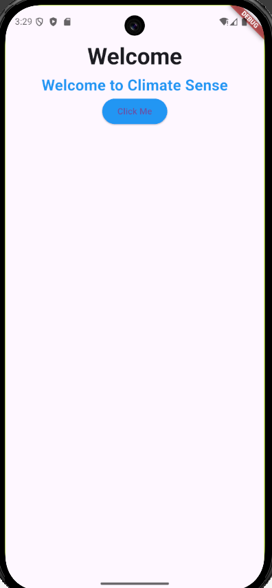

# ClimateSense 🌍

ClimateSense is a citizen-powered micro-climate intelligence mobile application that enables people to report local environmental issues such as flooding, pollution, heat, or water shortages, and view hyperlocal climate insights for their area.

The long-term goal of ClimateSense is to combine **citizen reports** with **official climate data** to generate real-time maps, alerts, and risk indicators that help communities take timely action.

This repository currently contains the **foundational Flutter setup and initial UI**, built as part of **Kalvium – Sprint 2 (Introduction to Flutter & Dart)**.

---

## 📱 App Overview

In this sprint, the app implements a **basic Welcome Screen** to establish the Flutter project structure and UI flow.

The screen includes:

- An AppBar
- A title introducing ClimateSense
- An icon representing environmental awareness
- A button demonstrating state change using Flutter’s `setState()`

This screen serves as the starting point for building more complex features like issue reporting, live dashboards, and alerts in future sprints.

---

## 📂 Project Folder Structure

lib/
├── main.dart # Entry point of the application
├── screens/ # Individual UI screens
│ └── welcome_screen.dart
├── widgets/ # Reusable UI components
│ └── welcome_button.dart
├── models/ # Data models (optional / future use)
├── services/ # API or Firebase logic (future use)

---

## 📁 Folder Explanation

### main.dart

- The entry point of the Flutter app.
- Initializes `MaterialApp` and sets the home screen.

### screens/

- Contains complete UI screens.
- Each screen represents a page in the app.

### widgets/

- Contains reusable UI components.
- Helps avoid code duplication.

### models/

- Stores data structures used by the app.
- Useful for API or database-driven features.

### services/

- Handles business logic like API calls or Firebase.
- Keeps UI and logic separated.

---

## 🧩 Naming Conventions

- Files: `snake_case.dart`
- Classes & Widgets: `PascalCase`
- Variables & Functions: `camelCase`
- One widget per file where possible

---

## ⚙️ Setup Instructions

### Prerequisites

- Flutter SDK installed
- Android Studio or VS Code
- Flutter & Dart extensions

Verify installation:

```bash
flutter doctor
```

### Run the Project

```bash
flutter pub get
flutter run
```

Run on an emulator of physical device

## 🎯 Features Implemented

- Scaffold with AppBar
- Column-based layout
- Text, Icon/Image, and Button widgets
- UI state change using setState()
- Modular folder structure

## 🧠 Learning Reflection

Through this assignment, I learned:

- How Flutter uses a widget-based architecture
- How Dart handles state and UI updates
- The importance of clean folder structure
- How setState() triggers widget rebuilds

This structure will help in building scalable and maintainable Flutter applications in future sprints.

## Demo:


